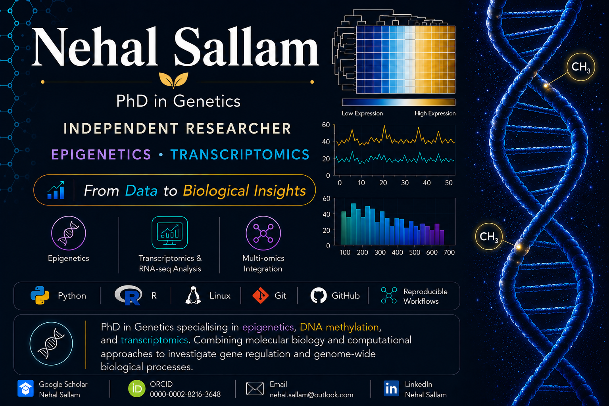

<p align="center">
  
</p>

# Hi, I'm Nehal Sallam 👋

**PhD in Genetics | Independent Researcher | Epigenetics & Bioinformatics**

I am a molecular geneticist with a PhD in Genetics, specializing in **epigenetics**, **DNA methylation**, and **transcriptomics**. My research combines molecular biology and computational approaches to investigate epigenetic regulation, gene expression, and genome-wide DNA methylation through transcriptomic and bisulfite sequencing analyses.

My research interests lie at the intersection of **epigenetics**, **DNA methylation**, **transcriptomics**, **genetics**, and **bioinformatics**, integrating molecular and computational approaches to transform complex biological data into meaningful scientific insights.

---

## 📄 Publications

### DNA methylation changes stimulated by drought stress in ABA-deficient maize mutant *vp10*

**Sallam, N., & Moussa, M. (2021).**  
*Plant Physiology and Biochemistry, 160*, 218–224.  
https://doi.org/10.1016/j.plaphy.2021.01.024

---

### Analysis of methylated genomic cytosines of maize inbred line W22 in response to drought stress

**Sallam, N., Moussa, M., Yacout, M., & El-Seedy, A. (2020).**  
*Cereal Research Communications.*  
https://doi.org/10.1007/s42976-020-00066-5

---

### Detection of DNA methylation in DBF1 gene of maize inbred W64A and mutant *vp14* exposed to drought stress

**Sallam, N., Moussa, M., Yacout, M., & Shakam, H. M. (2022).**  
*Cereal Research Communications.*  
https://doi.org/10.1007/s42976-021-00160-2

---

### Differential DNA methylation under drought stress in maize

**Sallam, N., & Moussa, M. (2019).**  
*International Journal of Current Microbiology and Applied Sciences.*  
https://doi.org/10.20546/ijcmas.2019.808.294

---

### Gene Expression Analysis of *TaDREB1* in Egyptian Wheat (*Triticum aestivum*) Cultivars under Drought Stress

**Sallam, N., Moussa, M., et al. (2024).**  
*Alexandria Science Exchange Journal.*  
https://doi.org/10.21608/ASEJAIQJSAE.2024.360051

---

## 🔬 Research Interests

- Epigenetics
- DNA Methylation
- Transcriptomics (RNA-seq)
- Gene Regulation
- Functional Genomics
- Genome-wide Data Analysis
- Bioinformatics
- Multi-omics Integration
- Reproducible Research

---

## 💻 Programming & Scientific Computing

- R
- Bash

---

## 🛠 Research Tools

- Linux
- RStudio
- Galaxy
- Git
- GitHub

---

## 🧬 Bioinformatics Skills

- RNA-seq Analysis
- Bisulfite Sequencing (BS-seq) Analysis
- Genome-wide DNA Methylation Analysis
- Differential Gene Expression Analysis
- Functional Enrichment Analysis
- Transcriptomics Workflows
- Data Visualization
- Reproducible Computational Pipelines

---

## 📚 Currently Learning

- Advanced Git & GitHub
- Reproducible Bioinformatics Workflows
- Workflow Automation
- Advanced RNA-seq Analysis
- NGS Data Analysis

---

## 🌱 Current Focus

Building reproducible computational workflows for genome-wide biological data analysis while expanding my expertise in computational biology and preparing for postdoctoral research opportunities in epigenetics, functional genomics, and transcriptomics.

---

## 📫 Connect with Me

- 📧 **Email:** [nehal.sallam@gmail.com](mailto:nehal.sallam@gmail.com)
- 💻 **GitHub:** https://github.com/Nehal-Sallam
- 💼 **LinkedIn:** https://www.linkedin.com/in/nehal-sallam-3b5b5131/
- 🎓 **Google Scholar:** https://scholar.google.com/citations?user=nFBDsrkAAAAJ&hl=en
- 🟢 **ORCID:** https://orcid.org/0000-0001-5614-399X

---

> **From Data to Biological Insights.** 🧬
```
